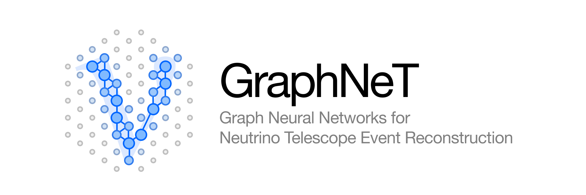

| Usage                                                                                                                                                              | Development |
|--------------------------------------------------------------------------------------------------------------------------------------------------------------------| --- |
|              |  |
|                                                           |  |
|                                                |  |
|                                                    |  |
|  |  |

## :rocket: About

**GraphNeT** is an open-source Python framework aimed at providing high quality, user friendly, end-to-end functionality to perform reconstruction tasks at neutrino telescopes using deep learning (DL). GraphNeT makes it fast and easy to train complex models that can provide event reconstruction with state-of-the-art performance, for arbitrary detector configurations, with inference times that are orders of magnitude faster than traditional reconstruction techniques.

Feel free to join the [GraphNeT Slack group](https://join.slack.com/t/graphnet-team/signup)!

### Publications using GraphNeT

| Type | Title | DOI |
| --- | --- | --- |
| Proceeding | Extending the IceCube search for neutrino point sources in the Northern sky with additional years of data | )) |
| Proceeding | Sensitivity of the IceCube Upgrade to Atmospheric Neutrino Oscillations | ) |
| Paper | GraphNeT: Graph neural networks for neutrino telescope event reconstruction |  |
| Paper | Graph Neural Networks for low-energy event classification & reconstruction in IceCube |  |

## :gear:  Install

GraphNeT is compatible with Python 3.8 - 3.11, Linux and macOS, and we recommend installing `graphnet` in a separate virtual environment. To install GraphNeT, please follow the [installation instructions](https://graphnet-team.github.io/graphnet/installation/install.html#quick-start)

## :ringed_planet:  Use cases

Below is an incomplete list of potential use cases for Deep Learning in neutrino telescopes.
These are categorised as either "Reconstruction challenges" that are considered common and that may benefit several experiments physics analyses; and those same "Experiments" and "Physics analyses".

<b>Reconstruction challenges</b>

| Title | Status | People | Materials |
| --- | --- | --- | --- |
| Low-energy neutrino classification and reconstruction | Done | Rasmus Ørsøe | https://arxiv.org/abs/2209.03042 |
| High-energy neutrino classification and reconstruction | Active | Rasmus Ørsøe | |
| Pulse noise cleaning | Paused | Rasmus Ørsøe, Kaare Iversen (past), Morten Holm | |
| (In-)elasticity reconstruction | Paused | Marc Jacquart (past) | |
| Multi-class event classification | Active | Morten Holm, Peter Andresen | |
| Data/MC difference mitigation |  | | |
| Systematic uncertainty mitigation |  | | |

<b>Experiments</b>

| Title | Status | People | Materials |
| --- | --- | --- | --- |
| IceCube | Active | (...) | |
| IceCube-Upgrade | Active | (...) | |
| IceCube-Gen2 | Active | (...) | |
| P-ONE | | (...) | |
| KM3NeT-ARCA | | (...) | |
| KM3NeT-ORCA | | (...) | |

<b>Physics analyses</b>

| Title | Status | People | Materials |
| --- | --- | --- | --- |
| Neutrino oscillations | | | |
| Point source searches | | | |
| Low-energy cosmic alerts | | | |
| High-energy cosmic alerts | | | |
| Moon pointing | | | |
| Muon decay asymmetry | | | |
| Spectra measurements | | | |

## :handshake:  Contributing

To make sure that the process of contributing is as smooth and effective as possible, we provide a few guidelines in the [contributing guide](https://graphnet-team.github.io/graphnet/contribute/contribute.html) that we encourage contributors to follow.

In short, everyone who wants to contribute to this project is more than welcome to do so! Contributions are handled through pull requests, that should be linked to a [GitHub issue](https://github.com/graphnet-team/graphnet/issues) describing the feature to be added or bug to be fixed. Pull requests will be reviewed by the project maintainers and merged into the main branch when accepted.

## :memo: License

GraphNeT has an Apache 2.0 license, as found in the [LICENSE](LICENSE) file.

## :raised_hands: Acknowledgements

This project has received funding from the European Union’s Horizon 2020 research and innovation programme under the Marie Skłodowska-Curie grant agreement No. 890778, and the PUNCH4NFDI consortium via DFG fund “NFDI39/1”.

[^1]: Examples of this are shown in the [examples/01_icetray/01_convert_i3_files.py](./examples/01_icetray/01_convert_i3_files.py) script
