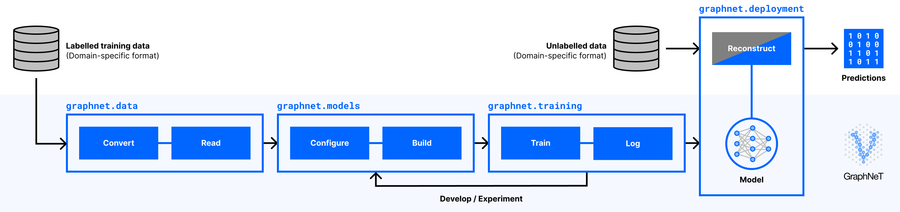

.. include:: ../substitutions.rst

|graphnet|\ GraphNeT is an open-source Python framework aimed at providing high quality, user friendly, end-to-end functionality to perform reconstruction tasks at neutrino telescopes using deep learning. |graphnet|\ GraphNeT makes it fast and easy to train complex models that can provide event reconstruction with state-of-the-art performance, for arbitrary detector configurations, with inference times that are orders of magnitude faster than traditional reconstruction techniques.
|graphnet|\ GraphNeT provides a common, detector agnostic framework for ML developers and physicists that wish to use the state-of-the-art tools in their research. By uniting both user groups, |graphnet|\ GraphNeT aims to increase the longevity and usability of individual code contributions from ML developers by building a general, reusable software package based on software engineering best practices, and lowers the technical threshold for physicists that wish to use the most performant tools for their scientific problems.

Usage
-----

|graphnet|\ GraphNeT comprises a number of modules providing the necessary tools to build workflows from ingesting raw training data in domain-specific formats to deploying trained models in domain-specific reconstruction chains, as illustrated in [the Figure](flowchart).

.. _flowchart:

    High-level overview of a typical workflow using |graphnet|\ GraphNeT: :code:`graphnet.data` enables converting domain-specific data to industry-standard, intermediate file formats and reading this data; :code:`graphnet.models` allows for configuring and building complex models using simple, physics-oriented components; :code:`graphnet.training` manages model training and experiment logging; and finally, :code:`graphnet.deployment` allows for using trained models for inference in domain-specific reconstruction chains.

:code:`graphnet.models` provides modular components subclassing :code:`torch.nn.Module`, meaning that users only need to import a few existing, purpose-built components and chain them together to form a complete model. ML developers can contribute to |graphnet|\ GraphNeT by extending this suite of model components — through new layer types, physics tasks, graph connectivities, etc. — and experiment with optimising these for different reconstruction tasks using experiment tracking.

These models are trained using :code:`graphnet.training` on data prepared using :code:`graphnet.data`, to satisfy the high I/O loads required when training ML models on large batches of events, which domain-specific neutrino physics data formats typically do not allow.

Trained models are deployed to a domain-specific reconstruction chain, yielding predictions, using the components in :code:`graphnet.deployment`. This can either be through model files or container images, making deployment as portable and dependency-free as possible.

By splitting up the model development as in :numref:`flowchart`, |graphnet|\ GraphNeT allows physics users to interface only with high-level building blocks or pre-trained models that can be used directly in their reconstruction chains, while allowing ML developers to continuously improve and expand the framework’s capabilities.

Acknowledgements
----------------

.. image:: ../../../assets/images/eu-emblem.jpg
    :width: 150

This project has received funding from the European Union’s Horizon 2020 research and innovation programme under the Marie Skłodowska-Curie grant agreement No. 890778.

The work of Rasmus Ørsøe was partly performed in the framework of the PUNCH4NFDI consortium supported by DFG fund "NFDI 39/1", Germany.