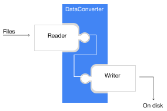

.. include:: ../substitutions.rst

Data Conversion in GraphNeT\ |graphnet-header|
==============================================

GraphNeT comes with powerful data conversion code that can convert data formats specific to experiments to deep learning friendly data formats.

Data conversion in GraphNeT follows a reader/writer scheme, where the :code:`DataConverter` does most of the heavy lifting.

    
    
    

In the illustration, the "reader" module represents an experiment-specific implementation of :code:`GraphNeTFileReader`, able to parse your data files. The "Writer" module denotes a :code:`GraphNeTWriter` module that saves the interim data format from :code:`DataConverter` to disk. 

:code:`DataConverter`
--------------------

:code:`DataConverter` provides parallel processing of file conversion and 
extraction from experiment-specific file formats to graphnet-supported data formats out-of-the-box.
:code:`DataConverter` can also assigns event ids to your events. 

Specifically, :code:`DataConverter` will manage multiprocessing calls to :code:`GraphNeTFileReader`\ s and passing their output to
:code:`GraphNeTWriter` which will save the extracted data from your files as a specific file format. 
Below is an example of configuring :code:`DataConverter` to extract data from :code:`.h5` files from the LiquidO experiment,
and to save the data as :code:`.parquet` files which are compatible with the :code:`ParquetDataset` in GraphNeT.

.. code-block::

    from graphnet.data.extractors.liquido import H5HitExtractor, H5TruthExtractor
    from graphnet.data.dataconverter import DataConverter
    from graphnet.data.readers import LiquidOReader
    from graphnet.data.writers import ParquetWriter

    # Your settings
    dir_with_files = '/home/my_files'
    outdir = '/home/my_outdir'
    num_workers = 5

    # Instantiate DataConverter - exports data from LiquidO to Parquet
    converter = DataConverter(file_reader = LiquidOReader(),
                              save_method = ParquetWriter(),
                              extractors=[H5HitExtractor(), H5TruthExtractor()],
                              outdir=outdir,
                              num_workers=num_workers,
                            )
    # Run Converter
    converter(input_dir = dir_with_files)
    # Merge files (Optional)
    converter.merge_files()

When :code:`converter(input_dir = dir_with_files)` is called, a `bijective` conversion is run, where every file
is converted independently and in parallel. I.e. the parallelization is done over files. 

The :code:`converter.merge_files()` call merges these many smaller files into larger chunks of data, and the specific behavior of :code:`GraphNeTWriter.merge_files()`
depends fully on the specific implementation of the :code:`GraphNeTWriter`.

This modular structure means that extending GraphNeT conversion code to export experiment data to new file formats is as easy as implementing a new :code:`GraphNeTWriter`.
Similarly, extending GraphNeT conversion code to work on data from a new experiment only requires implementing a new :code:`GraphNeTFileReader` and it's associated :code:`Extractors` .

:code:`Readers`
~~~~~~~~~~~~~~

Readers are experiment-specific file readers, written to be able to read and parse data from specific experiments.

Readers must subclass :code:`GraphNeTFileReader` and implement a  :code:`__call__` method that opens a file, applies :code:`Extractor`\ s and return either it's output in one of two forms:

- Serial Output: list of dictionaries, where the number of events in the file :code:`n_events` satisfies :code:`len(output) = n_events`. I.e each element in the list is a dictionary, and each field in the dictionary is the output of a single extractor. If this is provided, the :code:`DataConverter` will automatically assign event ids.

- Vectorized Output: A single dictionary where each field contains a single dataframe, which holds the data from the :code:`Extractor` for the entire file. In this case, the :code:`Reader` must itself assign event ids. This method is faster if your files are not storing events serially. 

In addition, classes inheriting from :code:`GraphNeTFileReader` must set class properties :code:`accepted_file_extensions` and :code:`accepted_extractors`.

.. raw:: html

    

    
<b>Example of a Reader</b>

    
Implementing a :code:`GraphNeTFileReader` to read data from your experiment requires writing just a few lines of code. 
Below is an example of a reader meant to parse and extract data from :code:`.h5` files from LiquidO, which output data in the vectorized format.

.. code-block:: python

    from typing import List, Union, Dict
    from glob import glob
    import os
    import pandas as pd

    from graphnet.data.extractors.liquido import H5Extractor
    from .graphnet_file_reader import GraphNeTFileReader

    class LiquidOReader(GraphNeTFileReader):
        """A class for reading h5 files from LiquidO."""

        _accepted_file_extensions = [".h5"]
        _accepted_extractors = [H5Extractor]

        def __call__(self, file_path: str) -> Dict[str, pd.DataFrame]:
            """Extract data from single parquet file.

            Args:
                file_path: Path to h5 file.

            Returns:
                Extracted data.
            """
            # Open file
            outputs = {}
            for extractor in self._extractors:
                output = extractor(file_path)
                if output is not None:
                    outputs[extractor._extractor_name] = output
            return outputs

        def find_files(self, path: Union[str, List[str]]) -> List[str]:
            """Search folder(s) for h5 files.

            Args:
                path: directory to search for h5 files.

            Returns:
                List of h5 files in the folders.
            """
            files = []
            if isinstance(path, str):
                path = [path]
            for p in path:
                files.extend(glob(os.path.join(p, "*.h5")))
            return files

.. raw:: html

    

:code:`Extractors`
~~~~~~~~~~~~~~~~~

Because rarely all the data available in files from experiments are needed for training deep learning models, GraphNeT uses :code:`Extractors` to extract only 
specific parts of the available data.

:code:`Extractors` are written to work with a specific :code:`GraphNeTFileReader` and should subclass :code:`Extractor`.

.. raw:: html

    

    
<b>Example of an Extractor</b>

    
Implementing an :code:`Extractor` to retrieve specific parts of your data files is easy. 
Below is an example of an :code:`Extractor` that will retrieve tables :code:`.h5` files from LiquidO.

.. code-block:: python

    class H5Extractor(Extractor):
        """Class for extracting information from LiquidO h5 files."""

        def __init__(self, extractor_name: str, column_names: List[str]):
            """Construct H5Extractor.

            Args:
                extractor_name: Name of the `H5Extractor` instance.
                Used to keep track of the provenance of different data,
                and to name tables to which this data is saved.
                column_names: Name of the columns in `extractor_name`.
            """
            # Member variable(s)
            self._table = extractor_name
            self._column_names = column_names
            # Base class constructor
            super().__init__(extractor_name=extractor_name)

        def __call__(self, file_path: str) -> pd.DataFrame:
            """Extract information from h5 file."""
            with h5py.File(file_path, "r") as f:
                available_tables = [f for f in f.keys()]
                if self._table in available_tables:
                    array = f[self._table][:]
                    # Will throw error if the number of columns don't match
                    self._verify_columns(array)
                    df = pd.DataFrame(array, columns=self._column_names)
                    return df
                else:
                    return None

        def _verify_columns(self, array: np.ndarray) -> None:
            try:
                assert array.shape[1] == len(self._column_names)
            except AssertionError as e:
                self.error(
                    f"Got {len(self._column_names)} column names but "
                    f"{self._table} has {array.shape[1]}. Please make sure "
                    f"that the column names match. ({self._column_names})"
                )
                raise e

.. raw:: html

    

:code:`Writers`
~~~~~~~~~~~~~~

Writers are methods used to save the interim data format from :code:`DataConverter` to disk. They subclass :code:`GraphNetWriter` and should 
implement the :code:`save_file method`, which recieves the interim data format from from a single file, and optionally the :code:`merge_files` method,
which will be called by :code:`DataConverter` through :code:`DataConverter.merge_files()`. 

Below is a conceptual example of how easy it is to extend the data conversion API to save files in a different format.
In this example, the writer will save the entire set of extractor outputs - a dictionary with pd.DataFrames - as a single pickle file.

.. code:: python

    from graphnet.data.writers import GraphNeTWriter
    import pickle

    class MyPickleWriter(GraphNeTWriter):

        _file_extension = ".pickle"
        _merge_dataframes = True   # `data` will be Dict[str, pd.DataFrame]

        def _save_file(
            self,
            data: Union[Dict[str, pd.DataFrame], Dict[str, List[pd.DataFrame]]],
            output_file_path: str,
            n_events: int,
        ) -> None:
            """Save the interim data format from a single input file.

            Args:
                data: the interim data from a single input file.
                output_file_path: output file path.
                n_events: Number of events container in `data`.
            """

            # Save file contents as .pickle
            with open(output_file_path, 'wb') as handle:
                pickle.dump(data, handle, protocol=pickle.HIGHEST_PROTOCOL)
            
            

        def merge_files(
            self,
            files: List[str],
            output_dir: str,
        ) -> None:
            """Merge smaller files.

            Args:
                files: Files to be merged.
                output_dir: The directory to store the merged files in.
            """
            raise NotImplementedError

Two writers are implemented in GraphNeT; the :code:`SQLiteWriter` and :code:`ParquetWriter`, each of which output files that are directly used for
training by :code:`ParquetDataset` and :code:`SQLiteDataset`.

