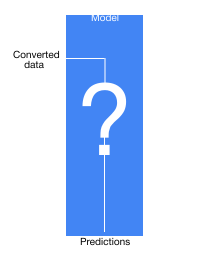
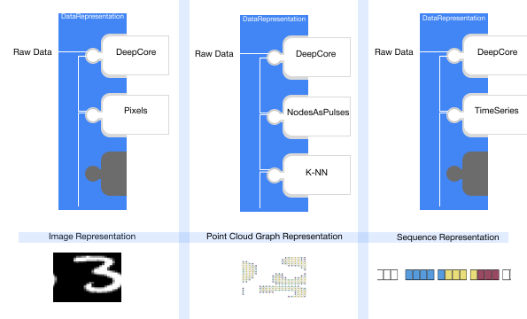

.. include:: ../substitutions.rst

Models In GraphNeT\ |graphnet-header|
=====================================

Three ideals form the philosophy behind `Model <https://graphnet-team.github.io/graphnet/api/graphnet.models.model.html>`_\ s in GraphNeT:

:Self-containment: Functionality that a specific model requires (data pre-processing, transformation and other auxiliary calculations) should exist within the :code:`Model` itself such that it is portable and deployable as a single package that only depends on data. 
                    I.e
                        Data → :code:`Model` → Predictions

:Summarizeable: Trained `Model <https://graphnet-team.github.io/graphnet/api/graphnet.models.model.html>`_\ s should be fully summarizeable to configuration files, allowing you to easily distribute the results of your experimentation to other |graphnet|\ GraphNeT users. 

:Reuseable: It should be easy and intuitive to repurpose existing `Model <https://graphnet-team.github.io/graphnet/api/graphnet.models.model.html>`_\ s to tackle new problems or work on new physics experiments.

To help developers adhere to these ideals, |graphnet|\ GraphNeT provides structure and functionality through class inheritance of :code:`Model`.   

.. note::
   A `Model <https://graphnet-team.github.io/graphnet/api/graphnet.models.model.html>`_ in |graphnet|\ GraphNeT is a :code:`LightningModule` configured to recieve as input :code:`torch_geometric.data.Data` objects.
   If you're unfamiliar with these terms, we recommend that you consult the `Lightning <https://lightning.ai/docs/pytorch/stable/starter/introduction.html>`_ and `PyG <https://pytorch-geometric.readthedocs.io/en/latest/get_started/introduction.html>`_ documentation for details.

The :code:`Model` class
-----------------

:code:`Model` is the generic base class for `Model <https://graphnet-team.github.io/graphnet/api/graphnet.models.model.html>`_\ s in GraphNeT, and forms the basis from which all models are expected to originate.
It comes with very few restrictions and you can therefore implement nearly any deep learning technique using |graphnet|\ GraphNeT by subclassing :code:`Model`.

Any subclass of :code:`Model` will inherit the methods :code:`Model.to_config` and :code:`Model.from_config`, which allows the model to be exported as :code:`.yml` files and reloaded in a different session. E.g.

.. code-block:: python

    model = Model(...)
    model.save_config("model.yml")

You can then reconstruct the same model architecture from the :code:`.yml` file:

.. code-block:: python

    from graphnet.models import Model

    # Indicate that you `trust` the config file after inspecting it, to allow for
    # dynamically loading classes references in the file.
    model = Model.from_config("model.yml", trust=True)

.. raw:: html

    

    
<b>Example of ModelConfig</b>

You can find several pre-defined :code:`ModelConfig`\ s under :code:`graphnet/configs/models`. Below are the contents of :code:`example_energy_reconstruction_model.yml`:

.. code-block:: yaml

    arguments:
    architecture:
        ModelConfig:
        arguments:
            add_global_variables_after_pooling: false
            dynedge_layer_sizes: null
            features_subset: null
            global_pooling_schemes: [min, max, mean, sum]
            nb_inputs: 4
            nb_neighbours: 8
            post_processing_layer_sizes: null
            readout_layer_sizes: null
        class_name: DynEdge
    graph_definition:
        ModelConfig:
        arguments:
            columns: [0, 1, 2]
            detector:
            ModelConfig:
                arguments: {}
                class_name: Prometheus
            dtype: null
            nb_nearest_neighbours: 8
            node_definition:
            ModelConfig:
                arguments: {}
                class_name: NodesAsPulses
            node_feature_names: [sensor_pos_x, sensor_pos_y, sensor_pos_z, t]
        class_name: KNNGraph
    optimizer_class: '!class torch.optim.adam Adam'
    optimizer_kwargs: {eps: 0.001, lr: 0.001}
    scheduler_class: '!class graphnet.training.callbacks PiecewiseLinearLR'
    scheduler_config: {interval: step}
    scheduler_kwargs:
        factors: [0.01, 1, 0.01]
        milestones: [0, 20.0, 80]
    tasks:
    - ModelConfig:
        arguments:
            hidden_size: 128
            loss_function:
            ModelConfig:
                arguments: {}
                class_name: LogCoshLoss
            loss_weight: null
            prediction_labels: null
            target_labels: total_energy
            transform_inference: '!lambda x: torch.pow(10,x)'
            transform_prediction_and_target: '!lambda x: torch.log10(x)'
            transform_support: null
            transform_target: null
        class_name: EnergyReconstruction
    class_name: StandardModel

and thus the 2. ideal outlined for models is directly addressed by simply subclassing :code:`Model`. In addition, :code:`Model` comes with extra functionality for saving, loading and checkpointing:
        

Saving, loading, and checkpointing :code:`Model`\ s
~~~~~~~~~~~~~~~~~~

There are several methods for saving models in GraphNeT and each comes with its own pros and cons.

:code:`Model.save`
~~~~~~~~~~~~~~~~~~

You can pickle your entire model (including the :code:`state_dict`) by calling the :py:meth:`~graphnet.models.model.Model.save` method:

.. code-block:: python

    model.save("model.pth")

You can then load this model by calling :py:meth:`~graphnet.models.model.Model.load` classmethod:

.. code-block:: python

    from graphnet.models import Model

    loaded_model = Model.load("model.pth")

.. warning::
    This method is rather convenient as it lets you store everything in a single file but it comes with a big caveat: **it's not version-proof**.
    That is, if you share a pickled model with a user who runs a different version of GraphNeT than what was used to train the model, you might experience compatibility issues.
    This is due to how pickle serialises Python objects.

:code:`ModelConfig` and :code:`state_dict`
~~~~~~~~~~~~~~~~~~~~~~~~~~~~~~~~~~~~~

You can summarise your :code:`Model` components and their configurations by exporting it to a :code:`.yml` file.
This only captures the `definition` of the model, not any trained weights, but by saving the :code:`state_dict` too, you have effectively saved the entire model, both definition and weights.
You can do so by:

.. code-block:: python

    model.save_config('model.yml')
    model.save_state_dict('state_dict.pth')

You can then reconstruct your model again by building the model from the `ModelConfig` file and loading in the `state_dict`:

.. code-block:: python

    from graphnet.models import Model
    from graphnet.utilities.config import ModelConfig

    model_config = ModelConfig.load("model.yml")
    model = Model.from_config(model_config)  # With randomly initialised weights.
    model.load_state_dict("state_dict.pth")  # Now with trained weight.

.. note::
    This method is the recommended way of storing and sharing :code:`Model`\ s.

Using checkpoints
~~~~~~~~~~~~~~~~~~

Because :code:`Model`\ s in GraphNeT are  PyTorch-Lightning's :code:`LightningModule`\ s, you have the option to use the :code:`load_from_checkpoint` method:

.. code-block:: python

    model_config = ModelConfig.load("model.yml")
    model = Model.from_config(model_config)  # With randomly initialised weights.
    model.load_from_checkpoint("checkpoint.ckpt")  # Now with trained weight.

You can find more information on checkpointing `here <https://lightning.ai/docs/pytorch/latest/common/checkpointing_basic.html>`_.

The :code:`StandardModel` class
-------------------------------
The simplest way to define a :code:`Model` in GraphNeT is through the :code:`StandardModel` subclass, which provides additional functionality on top of :code:`Model`. 

The :code:`StandardModel` consists of a series of modules - a `GraphDefinition <https://graphnet-team.github.io/graphnet/api/graphnet.models.graphs.html#module-graphnet.models.graphs>`_ , which defines the representation of the raw data,  `Backbone <https://graphnet-team.github.io/graphnet/api/graphnet.models.gnn.gnn.html#module-graphnet.models.gnn.gnn>`_, which defines the actual achitecture, and one or more `Task <https://graphnet-team.github.io/graphnet/api/graphnet.models.task.task.html#module-graphnet.models.task.task>`_  which defines the problem(s) that the model needs to solve. 

.. image:: ../../../assets/images/standardmodel.svg
    :width: 350
    :align: right
    :class: with-shadow

This structure guarantees modularity and reuseability of models in |graphnet|\ GraphNeT, as these modules are interchangeable. The role of each of these model components is outlined below.

For example, the only adaptation needed to run a :code:`StandardModel` made for IceCube on a different experiment — say, KM3NeT — would be to switch out the :code:`Detector` component in :code:`GraphDefinition`
representing IceCube with one that represents KM3NeT. Similarly, a :code:`Model` developed for `EnergyReconstruction <https://graphnet-team.github.io/graphnet/api/graphnet.models.task.reconstruction.html#graphnet.models.task.reconstruction.EnergyReconstruction>`_ 
can be put to work on a different problem, e.g., `DirectionReconstructionWithKappa <https://graphnet-team.github.io/graphnet/api/graphnet.models.task.reconstruction.html#graphnet.models.task.reconstruction.DirectionReconstructionWithKappa>`_ , 
by switching out just the `Task <https://graphnet-team.github.io/graphnet/api/graphnet.models.task.task.html#module-graphnet.models.task.task>`_ component.

components (such as instances of, e.g., the  :code:`GraphDefinition`, :code:`Backbone`, and :code:`Task` classes) along with PyTorch and PyG functionality.
All :code:`Model`\ s that are applicable to the same detector configuration, regardless of how the :code:`Model`\ s themselves are implemented, should be able to act on the same graph (:code:`torch_geometric.data.Data`) objects, thereby making them interchangeable and directly comparable.

:code:`GraphDefinition`, :code:`backbone` & :code:`Task` 
~~~~~~~~~~
These components are packaged in a particularly simple way in `StandardModel`, but they are not specific to it.
That is, they can be used in any combination, and alongside more specialised PyTorch/PyG code.

:GraphDefinition: A :code:`GraphDefinition` in GraphNeT is a data representation class, that uniquely defines how the raw data is processed and presented to the model architecture. `graphs` are a flexibile data representation format, which allows raw neutrino telescope data to be presented as point cloud graphs, images, sequences and more, making GraphNeT compatible with nearly all deep learning paradigms.

  A :code:`GraphDefinition` is itself composed of interchangeable modules, namely :code:`Detector`, :code:`NodeDefinition` and :code:`EdgeDefinition`.
  
  :Detector: The :code:`Detector` class holds experiment-specific details such as sensor geometry and index column names and defines standardization functions for each variable in the raw data.
  
  :NodeDefinition: :code:`NodeDefinition` defines what a node (i.e. a row and its columns) represents. In charge of transforming the collection of standardized Cherenkov pulses associated with a triggered event into a node/row representation of choice. It is the choice in this module that defines if nodes/rows represents single Cherenkov pulses, DOMs, entire strings or something completely different
  
  :EdgeDefinition: The optional :code:`EdgeDefinition` defines how `edges` are drawn between nodes in a graph, which for graph neural networks can define how information may flow in the network. Methods not requiring edges, such as CNNs or transformers can simply omit this module in their :code:`GraphDefinition`.

  .. note::

    The modularity of :code:`GraphDefinition` ensures that the only adaptation needed to run a :code:`StandardModel` made for IceCube on a different experiment — say, KM3NeT — would be to switch out the :code:`Detector` component in :code:`GraphDefinition`
    representing IceCube with one that represents KM3NeT. 

:Backbone: The :code:`Backbone` defines the actual model architecture that will be used to process the data representation, and its output is directly passed to :code:`Task`. 
  The model architecture could be based on CNNs, GNNs, transformers or any of the other established deep learning paradigms. :code:`Backbone` should be a subclass of :code:`Model`.

:Task:

  Different applications of deep learning in neutrino telescopes (i.e. the problems we want to solve using DL) are represented as individual detector agnostic :code:`Task`\ s.

  A :code:`Task` fully defines the physics problem that the model is trained to solve, and is in charge of scaling/unscaling truth values and calculation of loss.
  Multiple subclasses of :code:`Task` exists, most popular of which is :code:`StandardLearnedTask` that acts as a learnable prediction head that maps
  the latent output of :code:`backbone` to the target value(s). Many instances of :code:`StandardLearnedTask` has been implemented in GraphNeT to tackle a wide range of supervised learning tasks, such as binary classification and energy reconstruction.

  Below is an example of a :code:`StandardLearnedTask` that defines binary classification in general:

  .. code-block:: python

    from torch import Tensor
    from graphnet.models.task import StandardLearnedTask

    class BinaryClassificationTask(StandardLearnedTask):
        """Performs binary classification."""

        # Requires one feature, logit for being signal class.
        nb_inputs = 1
        default_target_labels = ["target"]
        default_prediction_labels = ["target_pred"]

        def _forward(self, x: Tensor) -> Tensor:
            # transform probability of being muon
            return torch.sigmoid(x)

  The class variable **nb_inputs** specifies the dimensions that this specific :code:`Task` expects it's input :code:`x` to have. In the case of :code:`StandardLearnedTask`, a simple MLP is used to adjust the dimensions of the latent prediction from :code:`backbone` to **nb_inputs**.
  :code:`_forward(self, x: Tensor)` , defines what the :code:`Task` does to the latent predictions.
  In this task :code:`x` will be a [batch_size,1]-dimensional latent vector and the :code:`Task` simply returns the sigmoid of it. 

  As such, the code in under :code:`_forward(self, x: Tensor)` defines the last steps of the :code:`Model`.

Instantiating a :code:`StandardModel`
~~~~~~~~~~~~~~~~~~~~~~~

GraphNeT comes with many pre-defined :code:`GraphDefinition`\ s, :code:`Backbone`\ s, and :code:`Task`\ s components that you can simply import and use out-of-the-box.
So to get started, all you need to do is to import your choices in these components and build the model.
Below is a snippet that defines a :code:`Model` that reconstructs the zenith angle with uncertainties using the `GNN published by IceCube <https://iopscience.iop.org/article/10.1088/1748-0221/17/11/P11003>`_ for ORCA150:

.. code-block:: python

    # Choice of graph representation, architecture, and physics task 
    from graphnet.models.detector.prometheus import ORCA150
    from graphnet.models.graphs import KNNGraph
    from graphnet.models.graphs.nodes import NodesAsPulses
    from graphnet.models.gnn.dynedge import DynEdge
    from graphnet.models.task.reconstruction import ZenithReconstructionWithKappa
    
    # Choice of loss function and Model class
    from graphnet.training.loss_functions import VonMisesFisher2DLoss
    from graphnet.models import StandardModel
    
    # Configuring the components
    
    # Represents the data as a point-cloud graph where each
    # node represents a pulse of Cherenkov radiation
    # edges drawn to the 8 nearest neighbours 
    
    graph_definition = KNNGraph(
        detector=ORCA150(),
        node_definition=NodesAsPulses(),
        nb_nearest_neighbours=8,
    )
    backbone = DynEdge(
        nb_inputs=graph_definition.nb_outputs,
        global_pooling_schemes=["min", "max", "mean"],
    )
    task = ZenithReconstructionWithKappa(
        hidden_size=backbone.nb_outputs,
        target_labels="injection_zenith",
        loss_function=VonMisesFisher2DLoss(),
    )
    
    # Construct the Model
    model = StandardModel(
        graph_definition=graph_definition,
        backbone=backbone,
        tasks=[task],
    )

The only change required to get this :code:`Model` to work on a different integrated experiment in GraphNeT, 
is to switch out the :code:`Detector`-component. Similarly, the model can be repurposed to solve a completely different problem,
by switching out the :code:`Task` component.

Training Syntax for :code:`StandardModel`
~~~~~~~~~~~~~~~~~~~~~~~~~~~~~~~~~~~~~~~~~~~~~

Models inheriting from :code:`StandardModel` in GraphNeT comes with a powerful in-built :code:`model.fit` method that reduces the training of models on neutrino telescopes to a syntax that is similar to that of :code:`sklearn`:

.. code-block:: python

    model = Model(...)
    train_dataloader = DataLoader(...)
    model.fit(train_dataloader=train_dataloader, max_epochs=10)

:code:`model.fit` is built upon `torch_lightning.Trainer.fit <pytorch_lightning import Trainer>`_ , and therefore accepts the same arguments, 
allowing GraphNeT users to train :code:`Model`\ s with the exact same functionality but with less boilerplate code. 

But because :code:`Model` s in GraphNeT are PyTorch modules and fully compatible with PyTorch-Lightning, you can also choose to write your own custom training loops if needed, or use the regular PyTorch-Lightning training functionality.
The snippet above is equivalent to:

.. code-block:: python

    from  torch_lightning import Trainer
    from  graphnet.training.callbacks import ProgressBar

    model = Model(...)
    train_dataloader = DataLoader(...)

    # Configure Trainer
    trainer = Trainer(
        gpus=None,
        max_epochs=10,
        callbacks=[ProgressBar()],
        log_every_n_steps=1,
        logger=None,
        strategy="ddp",
    )

    # Train model
    trainer.fit(model, train_dataloader)

Adding Your Own Model
-------------------------------------

Model architectures in GraphNeT are ordinary pytorch :code:`torch.nn.Module`\ 's that inherits from the generic :code:`graphnet.models.Model` class, 
and they are configured to receive :code:`torch_geometric.data.Data` objects as input to their :code:`forward` pass. 
Therefore, adding your pytorch models to GraphNeT is as easy as changing the inheritance and adjusting the input to expect :code:`Data` objects.

Below is an example of a simple pytorch model

.. code-block:: python

    import torch
    

    class MyModel(torch.nn.Module):

        def __init__(self, 
                     input_dim : int = 5,
                     output_dim : int = 10):

            super().__init__()
            self._layer = torch.nn.Linear(input_dim, output_dim)

        def forward(self, x: torch.Tensor) -> torch.Tensor:
            return self._layer(x)

Modifying this model to work in GraphNeT requires changing the inheritance to model, and configuring the input to be :code:`Data` objects:

.. code-block:: python

    import torch
    from graphnet.models import Model
    from torch_geometric.data import Data
    

    class MyGraphNeTModel(Model):

        def __init__(self, 
                     input_dim : int = 5,
                     output_dim : int = 10):

            super().__init__()
            self._layer = torch.nn.Linear(input_dim, output_dim)

        def forward(self, data: Data) -> torch.Tensor:
            x = data.x
            return self._layer(x)

The model is then ready to be used as a :code:`backbone` in :code:`StandardModel`, or to be included in your own implementation.

Experiment Tracking
--------------------

You can track your experiment using `Weights & Biases <https://wandb.ai/>`_ by passing the :code:`WandbLogger` to :py:func:`~graphnet.models.model.Model.fit`:

.. code-block:: python

    import os

    from pytorch_lightning.loggers import WandbLogger

    # Create wandb directory
    wandb_dir = "./wandb/"
    os.makedirs(wandb_dir, exist_ok=True)

    # Initialise Weights & Biases (W&B) run
    wandb_logger = WandbLogger(
        project="example-script",
        entity="graphnet-team",
        save_dir=wandb_dir,
        log_model=True,
    )

    # Fit Model
    model = Model(...)
    model.fit(
        ...,
        logger=wandb_logger,
    )

By using :code:`WandbLogger`, your training and validation loss is logged and you have the full functionality of Weights & Biases available.
This means, e.g., that you can log your :py:class:`~graphnet.utilities.config.model_config.ModelConfig`, :py:class:`~graphnet.utilities.config.dataset_config.DatasetConfig`, and :py:class:`~graphnet.utilities.config.training_config.TrainingConfig` as:

.. code-block:: python

    wandb_logger.experiment.config.update(training_config)
    wandb_logger.experiment.config.update(model_config.as_dict())
    wandb_logger.experiment.config.update(dataset_config.as_dict())

Using an experiment tracking system like Weights & Biases to track training metrics as well as artifacts like configuration files greatly improves reproducibility, experiment transparency, and collaboration.
This is because you can easily recreate an previous run from the saved artifacts, you can directly compare runs with diffierent model configurations and hyperparameter choices, and share and compare your results to other people on your team.
Therefore, we strongly recommend using Weights & Biases or a similar system when training and optimising models meant for actual physics use.

Example: Energy Reconstruction using :code:`ModelConfig`
--------------------------------------------------

Below is a minimal example for training a GNN in GraphNeT for energy reconstruction on a small data sample in GraphNeT, using configuration files:

.. code-block:: python

    # Import(s)
    import os

    from graphnet.constants import CONFIG_DIR  # Local path to graphnet/configs
    from graphnet.data.dataloader import DataLoader
    from graphnet.models import Model
    from graphnet.utilities.config import DatasetConfig, ModelConfig

    # Configuration
    dataset_config_path = f"{CONFIG_DIR}/datasets/training_example_data_sqlite.yml"
    model_config_path = f"{CONFIG_DIR}/models/example_energy_reconstruction_model.yml"

    # Build model
    model_config = ModelConfig.load(model_config_path)
    model = Model.from_config(model_config, trust=True)

    # Construct dataloaders
    dataset_config = DatasetConfig.load(dataset_config_path)
    dataloaders = DataLoader.from_dataset_config(
        dataset_config,
        batch_size=16,
        num_workers=1,
    )

    # Train model
    model.fit(
        dataloaders["train"],
        dataloaders["validation"],
        gpus=[0],
        max_epochs=5,
    )

    # Predict on test set and return as pandas.DataFrame
    results = model.predict_as_dataframe(
        dataloaders["test"],
        additional_attributes=model.target_labels + ["event_no"],
    )

    # Save predictions and model to file
    outdir = "tutorial_output"
    os.makedirs(outdir, exist_ok=True)
    results.to_csv(f"{outdir}/results.csv")
    model.save_state_dict(f"{outdir}/state_dict.pth")
    model.save(f"{outdir}/model.pth")

Because :code:`ModelConfig` summarises a :code:`Model` completely, including its :code:`Task`\ (s), 
the only modifications required to change the example to reconstruct (or classify) a different attribute than energy, is to pass a :code:`ModelConfig` that defines a model with the corresponding :code:`Task`.
Similarly, if you wanted to train on a different :code:`Dataset`, you would just have to pass a :code:`DatasetConfig` that defines *that* :code:`Dataset` instead.
